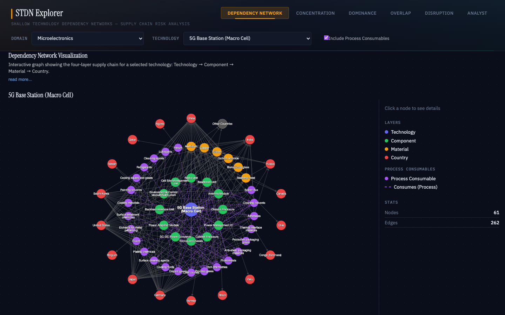
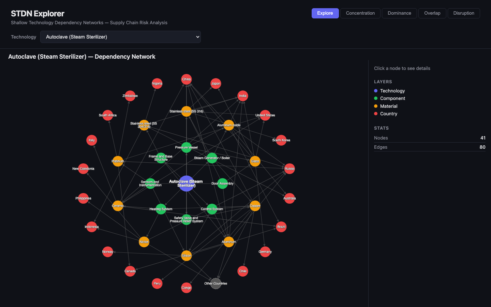
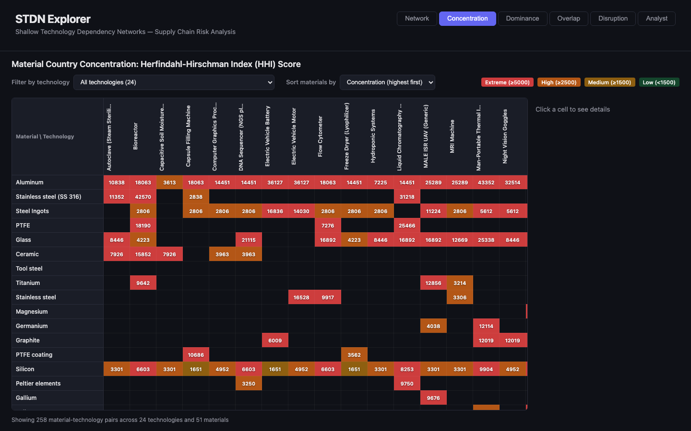
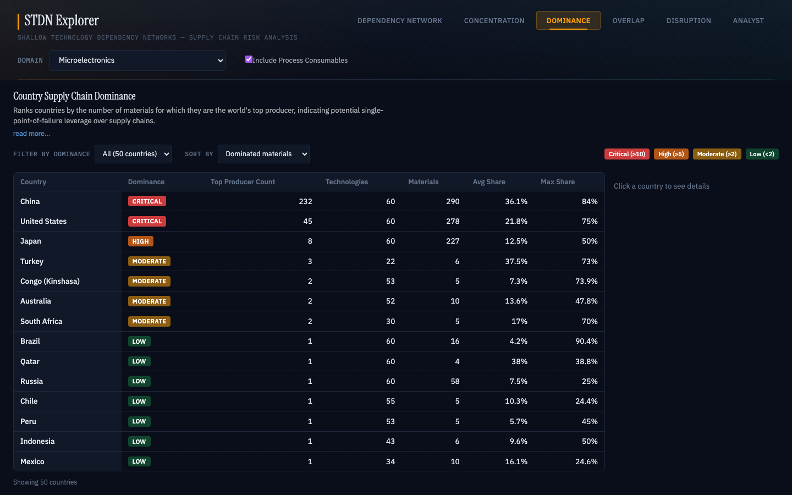
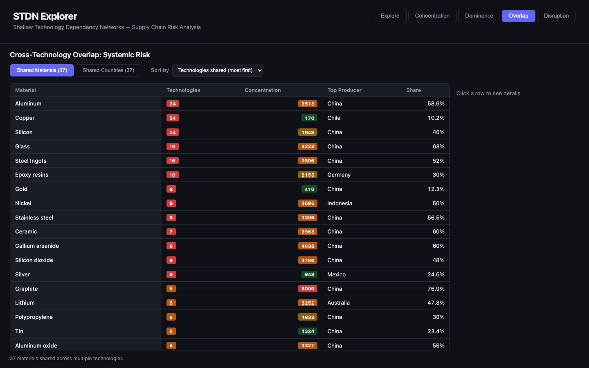
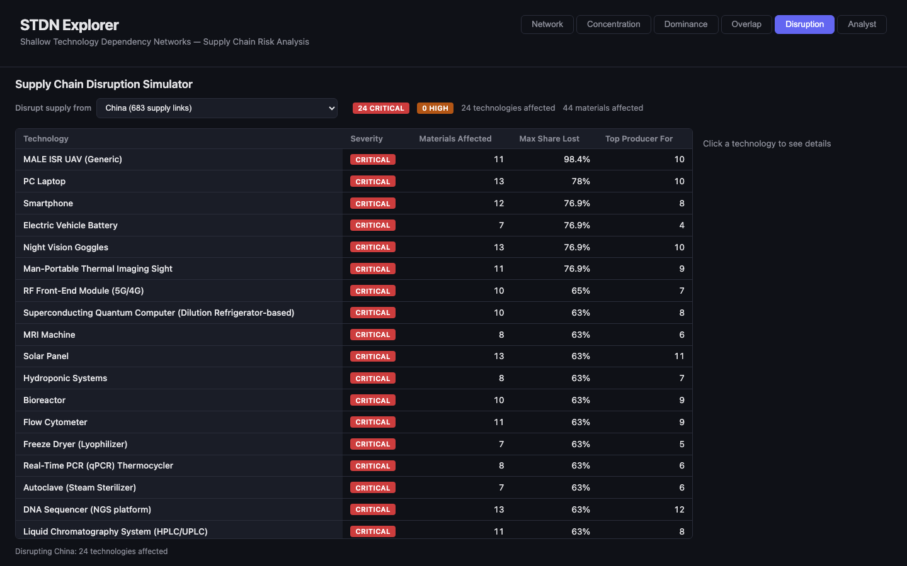
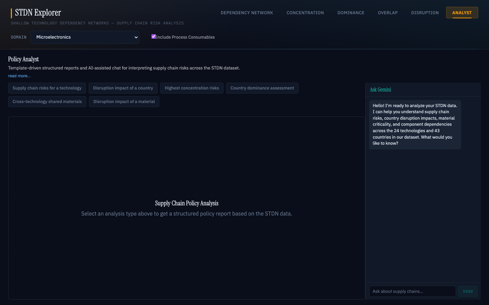

# STDN Explorer

Interactive dashboard for exploring **Shallow Technology Dependency Networks** (STDNs) — 4-layer directed acyclic graphs that map how technologies depend on components, raw materials, and producing countries.

Built as a companion tool for the technical report: *"From Technologies to Vulnerabilities: Multi-Agent Construction of Shallow Technology Dependency Networks for Supply Chain Risk Analysis"*.

**New to the dashboard?** See the [User Guide for Policy Analysts](docs/STDN_Explorer_User_Guide.md) or watch the [video walkthrough](docs/stdn_explorer_walkthrough.mp4), which walk through every section using a concrete scenario: tracing the technologies that depend on Helium and assessing the impact of a 40% reduction in Qatar's Helium production.

## What is an STDN?

An STDN captures the supply chain structure of a technology as a 4-layer DAG:

```
Technology → Components → Materials → Countries
```

For example, a **Smartphone** depends on a *Display Module*, which requires *Indium* (for ITO transparent conductors), which is primarily produced by *China* (57%), *South Korea* (15%), and *Japan* (10%).

## Domains

The explorer covers three technology domains, each with 60 products:

| Domain | Examples |
|---|---|
| **Microelectronics** | Smartphone, Data Center Server, MRI Machine, CubeSat On-Board Computer |
| **Biotechnology** | Real-Time PCR Thermocycler, Cryo-Electron Microscope, Viral Vector Production Bioreactor |
| **Pharmaceuticals** | Rotary Tablet Press, Aseptic Vial Filling Line, Medical Cyclotron |

A **Domain selector** in the header lets you switch between domains or view all 180 technologies combined. Each domain has its own set of technologies, components, materials, and country dependencies.



## Process Consumables

In addition to **constituent materials** (materials that physically become part of the product), the explorer shows **process consumables** — materials consumed during manufacturing but not present in the final product (e.g., Helium for leak testing, photoresists, cleaning solvents, etch chemicals).

Process consumables appear throughout the dashboard:
- **Graph view**: Purple nodes with dashed edges connecting to the technology node (assembly-level) or component nodes (component-level)
- **Analytical views**: "PC" badges next to process consumable materials in tables
- **Node detail panel**: "Process Consumable" badge with extraction provenance

A toggle in the header ("Include Process Consumables") controls their visibility in live mode.

## Dashboard Views

### Dependency Network
Interactive graph visualization (Cytoscape.js) showing the full 4-layer dependency network for a selected technology. Click nodes to inspect connected edges, material shares, and data provenance (USGS vs. LLM-estimated).

The **Domain** and **Technology** selectors in the header control which network is displayed.

**Legend**: The right panel shows layer colors (technology, component, material, country) and process consumable styling (purple nodes, dashed edges).



### Concentration
Heatmap of Herfindahl-Hirschman Index (HHI) scores for each material-technology pair. Higher HHI means production is concentrated in fewer countries — a supply chain risk signal.

The **Technology selector** in the header highlights and scrolls to the selected technology's column. All technologies remain visible for cross-comparison. Click rows/columns to cross-highlight and view detail panels.



### Dominance
Country-level analysis showing which nations dominate material production. Ranks countries by number of materials where they are the top global producer, with detail panels showing dominated materials (with "PC" badges for process consumables) and market shares.



### Overlap
Cross-technology systemic risk view. Identifies materials and countries shared across multiple technologies — single points of failure that could cascade across sectors if disrupted.



### Disruption
"What if" simulator. Select a country to disrupt and see per-technology severity assessments (Critical/High/Moderate/Low), affected materials (with dependency type badges), and maximum share lost. Drill down to component and material level.



### Analyst
Template-based policy analysis tool that generates structured supply chain risk assessments from the STDN dataset. Choose from 6 query templates:

1. **Supply chain risks for [technology]** — HHI concentration, critical materials, top producers
2. **Disruption impact of [country]** — affected technologies/materials by severity
3. **Highest concentration risks** — cross-technology HHI analysis, systemic chokepoints
4. **Country dominance of [country]** — dominated materials, technologies affected
5. **Cross-technology shared materials** — overlap data, systemic risk
6. **Disruption impact of [material]** — affected technologies, producing countries, concentration risk, systemic dependencies

Each response follows a structured format with risk assessment, vulnerability analysis, and recommendations. An optional **Ask Gemini** panel provides conversational AI analysis powered by the graph context.



### Cross-Tab Navigation
Material and country nodes on the Network tab include contextual navigation buttons:
- **Material nodes**: "See Technology/Material Market Concentration by Country" (scrolls to and highlights the technology column on the Concentration tab) and "See Cross-Technology Material Overlap" (greyed out for single-technology materials)
- **Country nodes**: "Material Dominance" (highlights the country row on the Dominance tab)


## Getting Started

### Prerequisites

- Python 3.11+ with [uv](https://docs.astral.sh/uv/)
- Node.js 18+

### Backend

```bash
cd backend
python -m venv .venv
source .venv/bin/activate
pip install -r requirements.txt
uvicorn main:app --port 8080
```

The API serves at `http://localhost:8080`. All endpoints accept `domain` and `include_process_consumables` query parameters.

| Endpoint | Description |
|---|---|
| `GET /api/technologies` | List all technologies |
| `GET /api/stdn/{technology}` | Graph data (nodes + edges) for Cytoscape.js |
| `GET /api/concentration` | HHI scores per material-technology pair |
| `GET /api/country-exposure` | Country dominance summary |
| `GET /api/overlap` | Cross-technology material/country overlap |
| `GET /api/disruption/{country}` | Disruption simulation for a country |
| `GET /api/countries` | List all countries with exposure counts |
| `GET /api/country/{country}` | Per-country technology/material exposure |
| `POST /api/graph-context` | Knowledge graph context for LLM queries |

**Query parameters** (all endpoints except graph-context):
- `domain` — `microelectronics` (default), `biotechnology`, `pharmaceuticals`, or `all`
- `include_process_consumables` — `true` (default) or `false`

### Frontend

```bash
cd frontend
npm install
npm run dev
```

Opens at `http://localhost:5173`.

### Gemini Integration (optional)

To enable the "Ask Gemini" chat panel on the Analyst tab, add your API key to `frontend/.env`:

```
VITE_GEMINI_API_KEY=your-key-here
```

The key is base64-encoded at build time to avoid GitHub secret scanning. In production (GitHub Pages), the key is injected via CI secrets.

## Project Structure

```
stdn-explorer/
├── backend/
│   ├── main.py              # FastAPI app — multi-domain loading, all endpoints
│   └── requirements.txt
├── frontend/
│   └── src/
│       ├── App.tsx           # Domain selector, tab navigation, global state
│       ├── App.css           # Dark theme styles
│       ├── components/
│       │   ├── StdnGraph.tsx           # Cytoscape.js graph with PC styling
│       │   ├── ConcentrationHeatmap.tsx # HHI heatmap with column highlighting
│       │   ├── CountryExposure.tsx      # Country dominance table
│       │   ├── CrossTechOverlap.tsx     # Systemic risk overlap
│       │   ├── DisruptionSimulator.tsx  # What-if simulator
│       │   ├── PolicyAnalyst.tsx        # Template-based policy analysis
│       │   ├── NodeDetail.tsx           # Graph node detail panel + nav buttons
│       │   ├── TechSelector.tsx         # Technology dropdown (with "All" mode)
│       │   └── analyst/
│       │       ├── types.ts                    # Analyst type definitions
│       │       ├── queryTemplates.ts            # 6 query template definitions
│       │       ├── analysisGenerators.ts        # Data → structured analysis
│       │       ├── AnalystChat.tsx              # Scrollable message list
│       │       ├── AnalystMessage.tsx           # Chat bubble component
│       │       └── AnalystResponseRenderer.tsx  # Section renderer (tables, stats)
│       └── hooks/
│           └── useApi.ts     # Domain-aware fetch hook (live + static modes)
├── scripts/
│   └── export_static.py     # Per-domain static JSON export for GitHub Pages
└── data/
    ├── microelectronics.csv  # 60 technologies, ~17K supply chain links
    ├── biotechnology.csv     # 60 technologies, ~14K supply chain links
    └── pharmaceuticals.csv   # 60 technologies, ~13K supply chain links
```

## Data

The three domain datasets were constructed by a multi-agent AI pipeline ([dpi_stdn_agentic](https://github.com/NSSAC/dpi_stdn_agentic)) that:

1. **Decomposes** technologies into procurable components via multi-agent debate (Stage 1)
2. **Identifies** constituent raw materials via multi-agent debate with ontology matching (Stage 2)
3. **Extracts** process consumables via single-agent extraction + judge (Stage 2b)
4. **Maps** materials to producing countries using USGS Mineral Commodity Summaries where available, falling back to LLM estimation with multi-agent consensus (Stage 3)

Each row includes confidence scores and reasoning chains for auditability. The `provenance` field distinguishes USGS-grounded data from LLM estimates. The `dependency_type` field distinguishes constituent materials from process consumables.

## Static Deployment

The explorer is deployed as a static site on GitHub Pages. To generate the static JSON files:

```bash
python scripts/export_static.py
```

This exports per-domain directories under `frontend/public/api/` (microelectronics, biotechnology, pharmaceuticals, all). The GitHub Actions workflow handles this automatically on push.

## Tech Stack

- **Backend**: FastAPI + Pandas + NetworkX
- **Frontend**: React 19 + TypeScript + Vite
- **Visualization**: Cytoscape.js (graph), custom CSS (heatmap/tables)
- **AI**: Gemini 2.5 Flash (optional chat panel)
- **Theme**: Dark mode with amber/indigo/purple accents

## License

MIT
