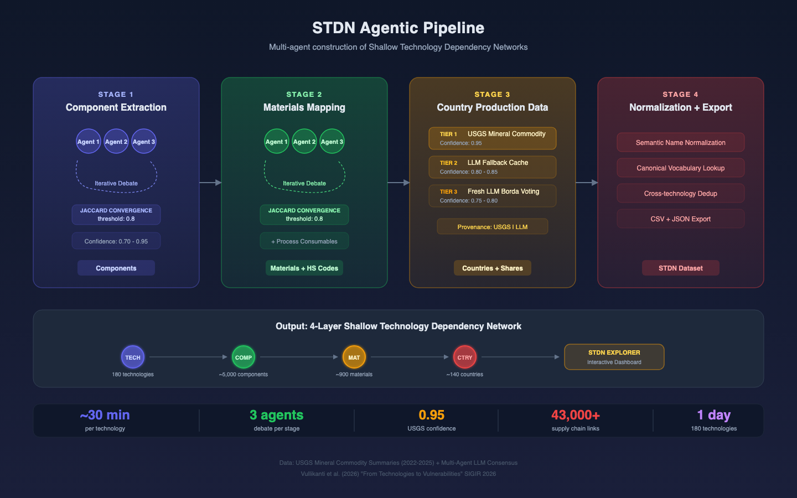

# STDN Explorer: system overview

## What it does

STDN Explorer is a web dashboard for investigating supply chain vulnerabilities across technology sectors. For each technology, it maps four layers of dependency: the finished product, its procurable components, the raw materials those components require, and the countries that produce those materials. These four layers form a directed graph called a Shallow Technology Dependency Network (STDN).

The current dataset covers three domains (microelectronics, biotechnology, and pharmaceuticals) with 60 technologies sampled from each, for 180 total. This is a demonstration sample. The system is domain-agnostic and can take on new domains and technologies without changes to the application itself. Adding a new domain of 60 technologies takes one day of compute, not a research team working for months.

A narrated video walkthrough is available at:
https://github.com/dads2busy/stdn-explorer/releases/download/v1.0.0/stdn_explorer_walkthrough.mp4

## How the data is built

The supply chain data is not manually assembled. A multi-agent AI pipeline constructs each STDN through structured debate and consensus. Multiple AI agents independently propose the components a technology requires, then reconcile their proposals through iterative rounds of debate with Jaccard-based convergence scoring. The same process repeats for identifying raw materials. Country production shares come from USGS Mineral Commodity Summaries where available. When USGS data does not cover a material, agents estimate shares through Borda voting with explicit confidence markings. Every row in the dataset carries a confidence score and a provenance tag indicating whether it came from USGS or agent consensus.

A single technology takes roughly 30 minutes to process through all four layers. The 180-technology demonstration dataset was built in parallel batch runs in a single day.

## Network visualizations

The dashboard has two graph-based views that let you explore supply chain structure visually.

### Technology network

The Technology Network draws the full four-layer dependency graph for a selected technology. The technology sits at the center, surrounded by concentric rings of components, materials, and countries. Nodes are color coded by layer: indigo for the technology, green for components, amber for constituent materials, purple for process consumables, and red for countries. Clicking any node opens a detail panel showing production shares, confidence scores, and data provenance. Navigation buttons on material nodes link directly to the Concentration or Overlap views with that material pre-selected.

### Material network

The Material Network works in the other direction. Pick a material and see every technology that depends on it, organized hierarchically by domain and subdomain. Selecting Helium shows that 152 of the 180 sample technologies depend on it across all three domains. Clicking a domain node narrows the graph to one sector. Double-clicking a technology node navigates to its Technology Network view.

## Analytical views

Five tabular views provide quantitative measures of supply chain risk.

### Concentration

The Concentration view is an HHI heatmap measuring how geographically concentrated each material's production is. Materials are rows, technologies are columns, and cells are color coded from green (diversified) through amber and orange to red (near-monopoly). Helium's HHI of 2,815 puts it in the "high concentration" range, with Qatar (38.8%) and the United States (35.3%) together accounting for over 74% of global output. Clicking any cell opens a detail panel with the exact score and a ranked list of producing countries.

### Dominance

The Dominance view ranks countries by how many materials they lead in as the world's top producer. China and the United States sit at the top with hundreds of top-producer positions each. Countries with Low dominance can still pose concentrated risk. Qatar leads in just one material but that material touches 173 technologies, giving it a disproportionate disruption footprint for a country that otherwise ranks near the bottom of the table.

### Overlap

The Overlap view finds materials and countries shared across many technologies. A material in only one technology's supply chain is an isolated risk. A material shared across 152 technologies is a systemic one. The Shared Materials tab lists every material appearing in two or more technologies, sorted by count. The Shared Countries tab flips the question, showing which countries supply the most technologies. Qatar appears at 173 technologies through only 10 materials at a 36.2% average share, a narrow but deep exposure.

### Supply disruption

The Supply Disruption simulator models what happens if a country stops producing entirely. Select a country and the tool shows how many technologies are affected, at what severity, and through which specific materials and components. Selecting Qatar produces 0 Critical, 152 High severity technologies, and 173 total affected. Expand any row to see the breakdown by component and material, including whether the dependency is a constituent material or a process consumable.

### Trade disruption

The Trade Disruption view uses a separate data source: actual US import values from the UN Comtrade database across multiple years. The Disruption Heatmap shows which countries' removal would cause the greatest loss of US import value per material. A slider adjusts how many countries are removed simultaneously. The Substitutability sub-tab measures supplier lock-in over time. For Helium, this view shows that Qatar was the top US import source through 2021 but Canada has since taken over. Global production share and actual US import exposure often tell different stories, and this view surfaces those discrepancies.

## Policy analysis and AI chat

The Analyst section generates structured policy reports from six templates, including supply chain risks for a technology, disruption impact of a country, and disruption impact of a material. Each report synthesizes data from across the other views into a single document with severity ratings, a systemic risk assessment, and recommendations.

An optional AI chat sidebar ("Ask Gemini") allows free-form follow-up questions using the full supply chain dataset as context. With a Helium disruption report loaded, asking "What is the potential trade disruption impact on the United States of a 40% reduction in Helium production by Qatar?" produces a response that calculates the global supply loss, identifies all affected technologies, and assesses the US market impact. The chat retains context from the generated report, so follow-up questions build on what was already produced.

## Methodology

The Methodology tab documents the formal definitions behind every metric: the HHI formula and its DOJ/FTC-derived thresholds, country dominance classifications, cross-technology overlap risk tiers, supply disruption severity criteria (referencing the European Commission's Critical Raw Materials methodology), and the trade disruption composite scoring formula. All data sources and the provenance distinction between USGS and LLM-estimated data are documented. For analysts who need to cite the dashboard's outputs in formal reports, this tab provides the methodological backing.

## Example scenario: Qatar and Helium

An analyst investigating a reduction in Qatar's Helium production would work through the dashboard roughly in this order:

Start with the Material Network to establish scope. Helium touches 152 technologies across all three domains. Move to the Technology Network to see how Helium enters any individual supply chain: as a process consumable for leak testing, not as a constituent material in the final product. Check Concentration for the market structure: HHI of 2,815, top two producers hold over 74%. Look at Dominance for Qatar's position: Low overall, but one material across 173 technologies. Confirm the systemic scope in Overlap: a disruption hits 152 technologies in parallel, not in sequence. Run the Supply Disruption simulator: all Qatar-dependent technologies get a High severity rating. Check Trade Disruption for the import picture: US exposure has shifted from Qatar to Canada since 2022. Generate a structured report from the Analyst section to pull it all together.

The dashboard does not tell an analyst what to do about the scenario. It tells them where to look and gives them numbers to work with.

## Data sources

Production share data comes from two sources, distinguished by provenance tags on every row:

- USGS Mineral Commodity Summaries (2022-2025): authoritative US government data for roughly 55 constituent minerals. Confidence: 0.95.
- Multi-agent LLM consensus: estimated shares for materials not covered by USGS, produced through structured debate with convergence thresholds. Confidence: 0.75-0.85.

Trade flow data comes from the UN Comtrade database, filtered to US imports by value.

## Access

The dashboard is deployed at https://dads2busy.github.io/stdn-explorer/ and requires no installation, login, or backend server. Source code, data, and documentation are at https://github.com/dads2busy/stdn-explorer.
