# STDN Explorer: a guide for supply chain policy analysis

## What is STDN Explorer?

STDN Explorer is a web dashboard for investigating supply chain vulnerabilities. The current dataset covers three domains (microelectronics, biotechnology, and pharmaceuticals) with 60 technologies sampled from each, for 180 total. These 180 are a sample, not a census. Each domain contains many more technologies that could be represented, and the system is designed so that new domains and their associated technologies can be added without changes to the application itself. The architecture is domain-agnostic: it operates on the four-layer structure of technology, component, material, and country regardless of what industry the data comes from.

For each technology, the dashboard maps four layers of dependency, starting from the finished technology, down through its procurable components, to the raw materials those components require, and finally to the countries that produce those materials. Each layer connects to the next through a directed graph, forming what the application calls a Shallow Technology Dependency Network (STDN).

The tool is built around questions like: Which technologies are most exposed to a disruption in a specific country's output? Which materials create shared vulnerabilities across many technologies at once? Where does a single country hold enough market share to be considered a chokepoint?

This guide walks through each section of the dashboard using a concrete scenario: tracing technologies that rely on Helium and working out what a 40% reduction in Helium production from Qatar would mean across all three sectors.

## Video walkthrough

A narrated video walkthrough of the dashboard is available below. It covers the same Helium/Qatar scenario described in this guide, demonstrating each section with live browser interactions.

https://github.com/dads2busy/stdn-explorer/releases/download/v1.0.0/stdn_explorer_walkthrough.mp4

---

## Getting oriented: domain selection and controls

At the top of every view, a domain selector scopes your analysis to Microelectronics, Biotechnology, Pharmaceuticals, or All Domains. A checkbox labeled "Include Process Consumables" controls whether the analysis includes materials consumed during manufacturing that do not end up in the final product.

The process consumable distinction matters for Helium. In nearly every technology that depends on it, Helium is a process consumable: used for leak testing, optical path purging, and cryogenic cooling during production. The one exception is MRI machines, where liquid Helium is a constituent material in the final device. Turning off the process consumables filter would hide Helium's role in 172 of the 173 technologies it touches. For a Helium supply risk analysis, keep this filter on.

Selecting "All Domains" aggregates data across all technologies in every loaded domain (currently 180), which is where you want to start for a material like Helium that appears in all three sectors. As new domains or technologies are added to the system, this aggregated view would include them automatically.

---

## Section 1: Technology network

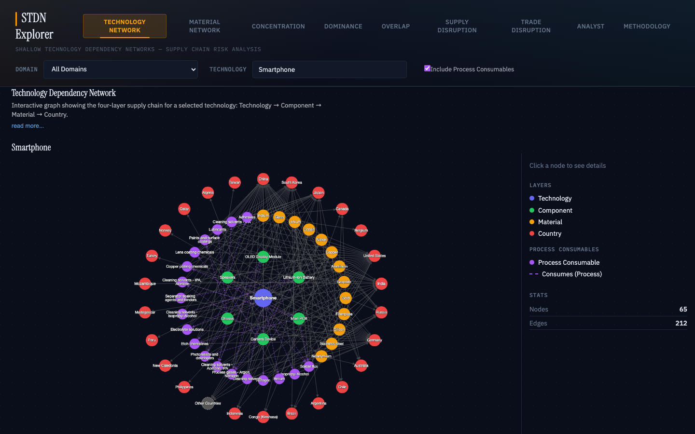

The Technology Network is the main visualization for a single technology's full supply chain. Select a technology (here, Smartphone) and the dashboard draws a graph with four concentric rings. The technology sits at the center. Its components occupy the next ring. The materials those components require fill the third ring. The countries that produce those materials form the outermost ring.

Nodes are color coded by layer: indigo for the technology, green for components, amber for constituent materials, purple for process consumables, and red for countries. Dashed purple lines indicate process consumable relationships, while solid lines connect constituent materials.

Clicking any node opens a detail panel on the right side. For a country node, this panel shows the country's production share for that material and whether the data comes from USGS publications or from estimated sources. For a material node, the panel shows confidence scores and navigation buttons that jump to the Concentration, Overlap, or Dominance views with that material already selected.

In the Helium scenario, selecting Smartphone in All Domains mode and clicking on the Helium node would show Qatar holding a 38.8% production share. The detail panel would also offer navigation links to explore Helium's concentration profile and cross-technology overlap from the other tabs.

---

## Section 2: Material network

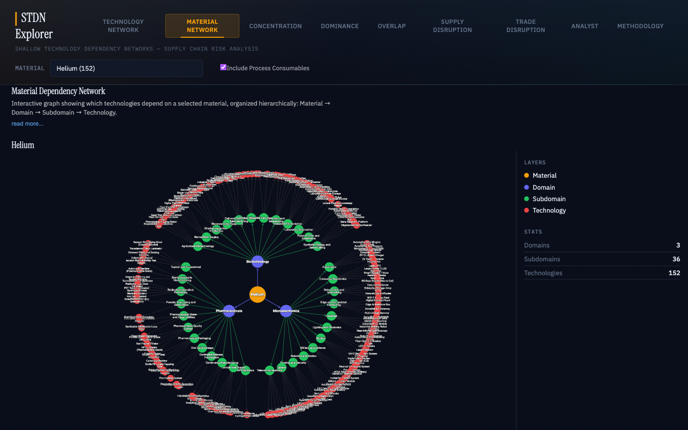

The Material Network works in the other direction. Instead of starting from a technology and looking outward to its materials and suppliers, you start from a single material and see every technology that depends on it.

Select Helium from the material dropdown and the graph immediately shows 152 technologies across all three domains. Helium sits at the center. The next ring out shows the three industry domains (Microelectronics, Biotechnology, Pharmaceuticals). Beyond that, subdomains fan out, and the outermost ring shows individual technologies.

The sidebar displays summary statistics: 3 domains, 36 subdomains, 152 technologies. Clicking on a domain node narrows the graph to just that domain's subdomains and technologies. Double-clicking a technology node takes you to the Technology Network view with that technology loaded.

For the Qatar/Helium scenario, this is where the breadth of the problem becomes clear. Helium is not a niche material. It touches 152 out of 180 technologies in the dataset: Smartphones, PCR Thermocyclers, Aseptic Vial Filling Lines, and 149 others. A disruption to Helium supply hits almost everything.

---

## Section 3: Concentration

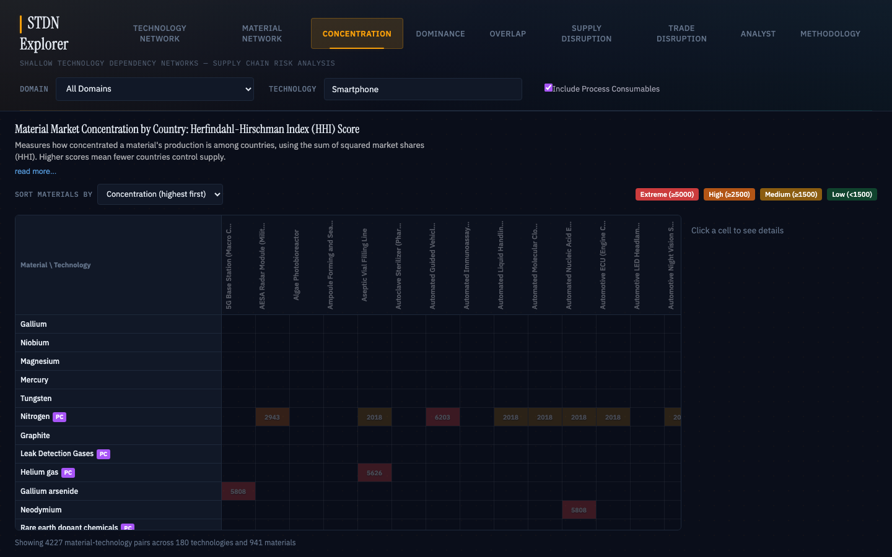

The Concentration view measures how geographically concentrated each material's production is, using the Herfindahl-Hirschman Index (HHI). The HHI is calculated by squaring each producing country's market share percentage and summing the results. A score of 10,000 means a single country controls all production. Below 1,500 indicates a diversified supply base.

The layout is a heatmap with materials as rows and technologies as columns. Cells are color coded: green for low concentration (below 1,500), amber for medium (1,500 to 2,500), orange for high (2,500 to 5,000), and red for extreme (above 5,000). You can sort materials by concentration level to push the highest-risk entries to the top.

Helium's HHI across most technologies is approximately 2,815, which falls in the "high concentration" range. The top three producers are Qatar (38.8%), the United States (35.3%), and Algeria (5.9%). Only six countries produce Helium at any meaningful scale, and the top two account for over 74% of global output.

Clicking on a Helium cell opens a detail panel with the exact HHI score, the number of producing countries, and a ranked list with production shares. Here the Qatar scenario gets quantitative: Qatar's 38.8% share, combined with an already concentrated market, means a 40% reduction in Qatar's Helium output removes roughly 15.5% of global supply. The remaining producers together lack the spare capacity to absorb that shortfall quickly.

---

## Section 4: Dominance

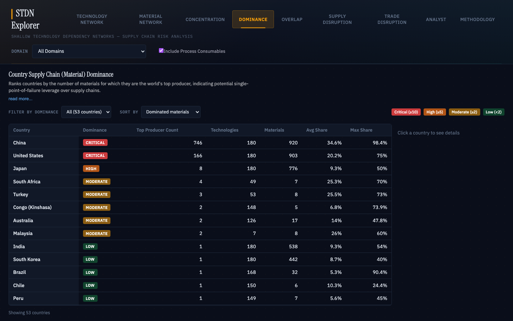

The Dominance view ranks countries by the number of materials for which they are the world's top producer. It asks a different question than concentration: not "how concentrated is this material?" but "how many materials does this country control?"

The table shows each country's dominance classification (Critical, High, Moderate, or Low), how many materials it leads in, how many technologies it affects, and its average and maximum market shares. China and the United States sit at the top as Critical, with 746 and 166 top-producer positions. Japan follows as High with 8.

Qatar appears further down the table with a Low dominance classification. It is the top producer for one material variant and supplies materials to 173 technologies. Its average share is 36.2% and its maximum is 38.8%. Click Qatar's row and you see that its supply chain influence comes almost entirely through Helium and its variants (Helium gas, Helium for leak testing, and several others).

Qatar is not a dominant producer in the way China or the United States is. But its concentration in a single material that happens to touch nearly every technology in the dataset gives it a disproportionate disruption potential. Qatar's risk profile is narrow but deep: one material, 173 technologies.

---

## Section 5: Overlap

The Overlap view finds materials and countries that are shared across many technologies. A material in only one technology's supply chain is an isolated risk. A material shared across dozens or hundreds of technologies is a point where a single disruption propagates widely and simultaneously. The view has two sub-tabs, each approaching this from a different angle.

### Shared Materials

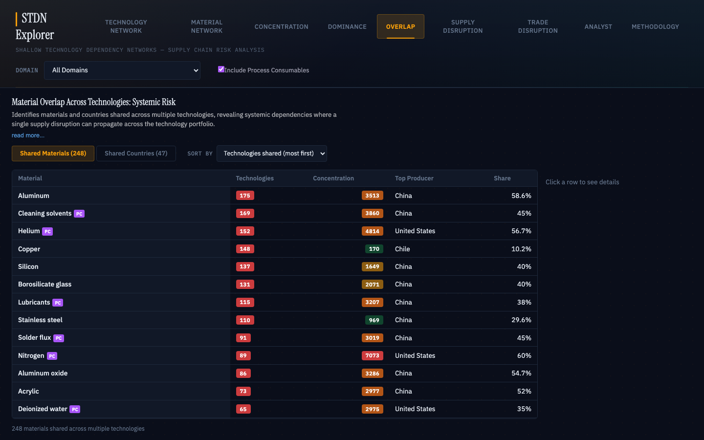

The Shared Materials tab lists every material appearing in two or more technologies, sorted by the count of technologies that depend on it. Each row shows the material name, how many technologies share it, the material's HHI concentration score, the top producer, and that producer's share. In the current dataset, 248 materials are shared across multiple technologies.

Helium appears near the top: 152 technologies, HHI of 2,815, Qatar as top producer at 38.8%. Only Aluminum (175 technologies) and Cleaning solvents (169) appear in more. Helium is both widely shared and concentrated in a small number of producing countries. That combination is what makes it a systemic risk rather than just a common input.

Clicking a material row opens a detail panel showing exactly which technologies depend on it. For Helium, that list spans all three domains.

### Shared Countries

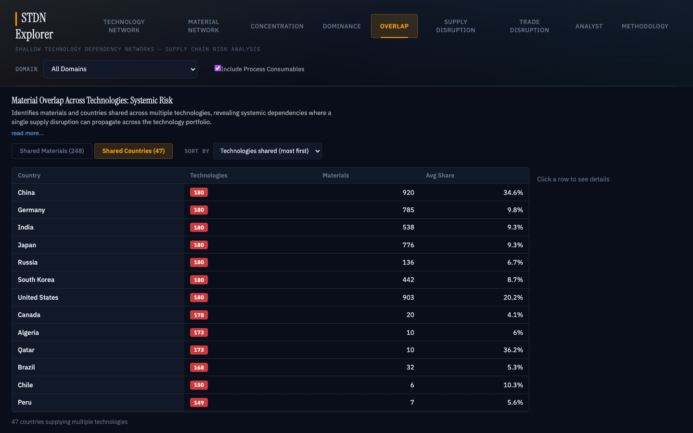

The Shared Countries tab flips the question: instead of asking which materials are shared, it asks which countries supply materials to the most technologies. Each row shows a country, the number of technologies it supplies, how many distinct materials it provides, and its average production share across all of them.

The top of the list is dominated by countries that supply many different materials to many technologies. China, Germany, India, and Japan each touch all 180 technologies. Qatar appears further down at 173 technologies, but its row tells a different story than the countries above it. Those countries supply hundreds of distinct materials at relatively low average shares. Qatar supplies only 10 materials at an average share of 36.2%. Its overlap is narrow in material count but broad in technology reach, and its average share per material is among the highest in the table.

For the Helium scenario, these two sub-tabs together answer the question of scope. The Shared Materials tab shows that Helium is in 152 technologies simultaneously. The Shared Countries tab shows that Qatar, through Helium and a handful of related materials, touches 173 technologies at a 36.2% average share. A disruption does not cascade through a chain. It hits 152 technologies in parallel. Compare that to a material like Gallium Arsenide, which might score higher on concentration but affects far fewer technologies. The distinction between concentrated-but-narrow and concentrated-and-wide is what this view is designed to surface.

---

## Section 6: Supply disruption

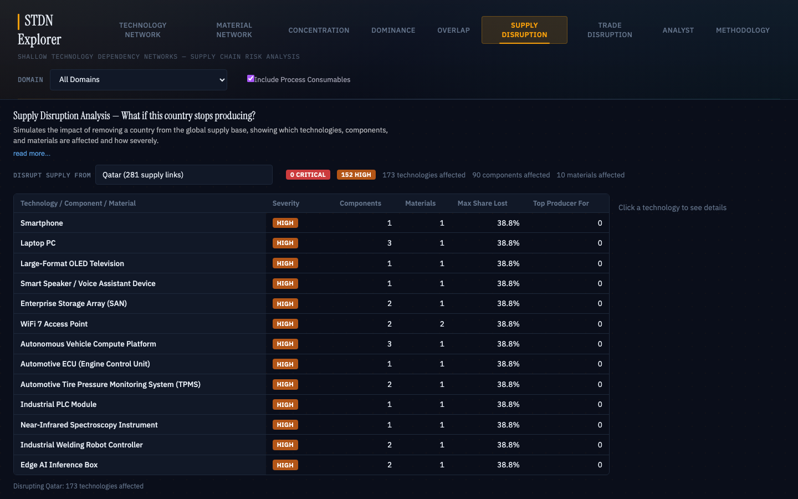

The Supply Disruption simulator is the most directly scenario-oriented section. Select a country from a dropdown and the tool models the impact of that country ceasing all production. The results show how many technologies are affected, at what severity, and through which materials and components.

Selecting Qatar runs the analysis across all domains. The summary bar reads: 0 Critical, 152 High, 173 technologies affected, 90 components affected, 10 materials affected. Every affected technology appears in a table with its severity classification, affected component and material counts, the maximum share lost, and how many materials Qatar leads in.

The severity classifications use concrete thresholds. High severity means the maximum production share lost is 30% or higher, or the disrupted country is the top producer for at least one of that technology's materials. Since Qatar holds 38.8% of Helium production, every technology using Helium automatically gets a High severity rating.

Expanding any row in the table shows the specific materials and components affected. For Smartphone, the expansion shows one material (Helium) at 38.8% share, classified as a process consumable. For Laptop PC, Helium affects three components (Processor Chip, Processor Core, and assembly-level processes).

One caveat: the simulator models a complete removal of the selected country's production. For the 40% partial reduction in this scenario, you would need to scale the results. Qatar's 38.8% share reduced by 40% means a loss of about 15.5 percentage points of global Helium supply. The severity ratings assume total removal and would overstate the impact of a partial reduction. But the simulator still correctly identifies which technologies are exposed and through which pathways, and that is the information you need to start assessing mitigation options.

---

## Section 7: Trade disruption

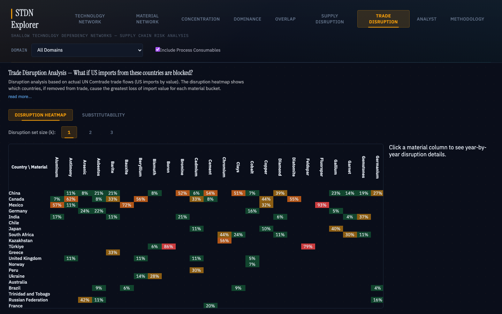

The Trade Disruption view uses a different data source than the rest of the dashboard. The other sections use production share data (what percentage of a material does each country produce?). Trade Disruption uses actual US import values from the UN Comtrade database, measured in dollars, across multiple years.

Production share and trade flow do not always align. A country might produce a large share of a material globally but export very little of it to the United States, or the reverse. This section surfaces those discrepancies. It has two sub-tabs.

### Disruption heatmap

The Disruption Heatmap sub-tab shows a grid with countries as rows and materials as columns. Each cell contains a composite disruption score: the percentage of US import value that would be lost if that country were removed from the supply base, averaged across all years in the dataset. A slider labeled "Disruption set size (k)" lets you adjust how many countries are removed simultaneously. At k=1, you see which single country's removal causes the most damage for each material. At k=2 or k=3, you see the worst pairs or triples.

For Helium at k=1, the data tells a story that differs from the production share picture. Qatar was the single most disruptive country to remove from 2017 through 2021, with disruption scores ranging from 0.29 to 0.48. But starting in 2022, Canada replaced Qatar as the top disruption source, with scores climbing to 1.0 by 2025. This means that even though Qatar produces roughly 38.8% of global Helium, recent US Helium imports have shifted heavily toward Canada. A Qatar production reduction would still tighten global supply, but the direct US import exposure has been declining.

### Substitutability

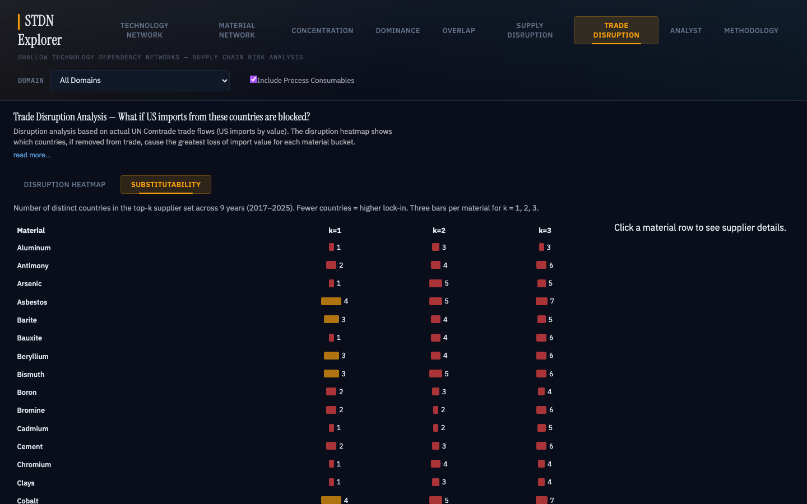

The Substitutability sub-tab measures supplier lock-in. For each material, it counts how many distinct countries have appeared in the top-k disruption set across all years in the dataset (2017 through 2025). Fewer distinct countries means more lock-in: the same suppliers dominate year after year with little rotation.

Helium at k=1 shows only 2 distinct countries across 9 years (Qatar and Canada), out of a maximum possible 9. At k=2, the count rises to 5 (adding Algeria, China, and Ukraine). This tells an analyst that Helium's US import base is tightly locked in at the single-supplier level but somewhat more diversified when you look at the top two suppliers together.

For the Qatar scenario, the Trade Disruption view adds an important nuance that the production-share-based sections miss. Qatar's global production share is 38.8%, but its share of actual US Helium imports has dropped since 2022. A 40% reduction in Qatar's output would still pressure global prices and availability, but the direct US import impact would be smaller than the production share alone suggests.

---

## Section 8: Analyst

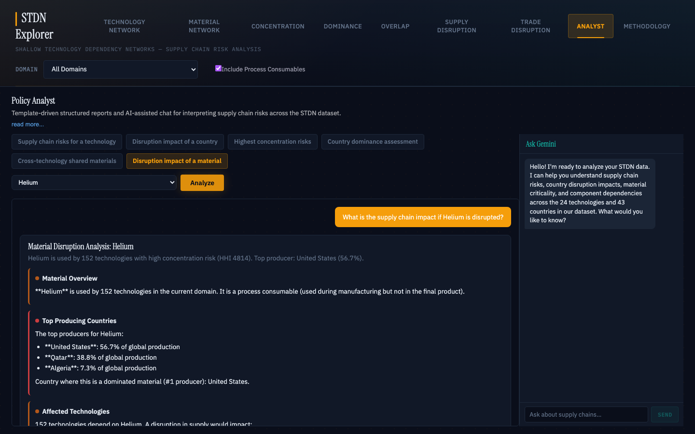

The Analyst section generates structured reports from six templates: supply chain risks for a technology, disruption impact of a country, highest concentration risks, country dominance assessment, cross-technology shared materials, and disruption impact of a material. Each template takes a parameter (a technology name, country, or material) and produces a report that synthesizes data from across the other sections.

To continue the Helium scenario, select "Disruption impact of a material" and choose Helium. The tool generates a report titled "Material Disruption Analysis: Helium" that opens with a summary line: used by 152 technologies, high concentration risk (HHI 2,815), top producer Qatar at 38.8%.

The report is organized into sections. Material Overview confirms that Helium is a process consumable used during manufacturing but not present in the final product. Top Producing Countries lists Qatar at 38.8%, the United States at 35.3%, and Algeria at 5.9%. Affected Technologies lists the 152 dependent technologies with their individual HHI scores and severity ratings. Most are flagged High.

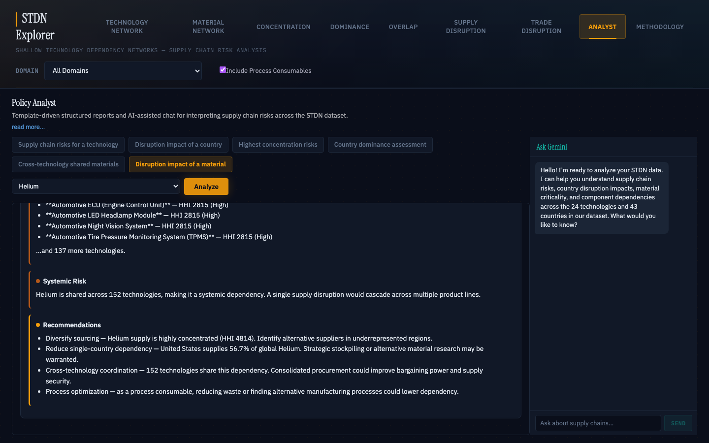

Scrolling down, the Systemic Risk section states directly that Helium is shared across 152 technologies, making it a systemic dependency where a single supply disruption would cascade across multiple product lines. The Recommendations section offers four lines of action: diversify sourcing to underrepresented regions, reduce dependency on the top two producers (Qatar and the United States, which together supply over 74%), coordinate procurement across the 152 technologies that share this dependency, and investigate alternative manufacturing processes that could reduce Helium consumption.

### Ask Gemini

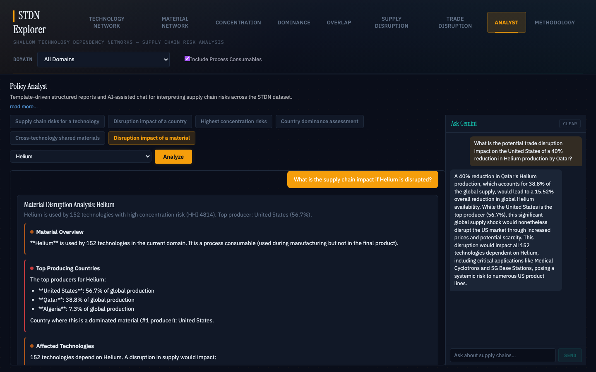

An AI chat sidebar ("Ask Gemini") appears on the right side of the Analyst view. It has access to the full supply chain dataset and retains context from whatever report you just generated, so follow-up questions can build on the structured analysis.

With the Helium disruption report still loaded, entering the question "What is the potential trade disruption impact on the United States of a 40% reduction in Helium production by Qatar?" produces a response that ties together the production share data and the technology dependency graph. Gemini's response calculates the 15.52% global supply reduction (40% of Qatar's 38.8% share), notes that even with the United States as a major producer, the US would still face price increases and scarcity from a global supply shock of that size, and flags that all 152 Helium-dependent technologies would be affected, calling out Medical Cyclotrons and 5G Base Stations as examples. The response concludes that the reduction poses a systemic risk to multiple US product lines.

The chat accepts any free-form question. Other useful queries for this scenario might include "Which Helium-dependent technologies are in the pharmaceuticals domain?" or "What would the combined impact look like if both Qatar and Algeria reduced output?" Each answer draws on the same underlying dataset that powers the rest of the dashboard.

Where the other sections give you raw data and interactive exploration, the Analyst section produces output closer to what would appear in a policy memo or briefing document.

---

## Section 9: Methodology (reference)

The Methodology tab documents the formal definitions behind every metric in the dashboard. It covers the STDN graph structure and node/edge types, the HHI concentration formula and its DOJ/FTC-derived thresholds, the country dominance classification, the cross-technology overlap risk tiers, the supply disruption severity criteria (with references to the European Commission's Critical Raw Materials methodology), the trade disruption analysis including the disruption score formula g_i(S), the composite heatmap scoring method, and the substitutability lock-in measure. It also lists all data sources and the provenance distinction between USGS and LLM-estimated data. If you need to cite the tool's outputs in a formal report, this is where you find the methodological backing.

---

## Putting it together: the Qatar Helium scenario

An analyst investigating a 40% reduction in Qatar's Helium production would work through the dashboard roughly in this order:

Start with the Material Network. Helium touches 152 technologies across all three domains. This is not a narrow risk.

Move to the Technology Network for any individual technology. Click through the graph and you see Helium entering the supply chain as a process consumable, typically for leak testing or purging. Without Helium, the manufacturing process stalls even though Helium is not in the final product.

Check Concentration for the market structure. Helium's HHI of 2,815 means high concentration. Six countries produce it. The top two account for over 74% of supply.

Look at Dominance for Qatar's position. It is not a dominant producer overall, but its influence is concentrated in a single material that touches nearly the entire dataset.

Use Overlap to confirm the systemic scope. Helium is shared across 152 technologies simultaneously. A disruption does not cascade through a chain. It hits 152 technologies in parallel.

Run the Supply Disruption simulator. All 173 Qatar-dependent technologies receive a High severity rating. Maximum share lost: 38.8%.

Check Trade Disruption for the import-side picture. Qatar was the top US Helium import source through 2021, but Canada has since taken over. The Substitutability tab confirms that only two countries have held the top import position across nine years. Global production share and actual US import exposure are telling different stories, and both matter for policy.

Finally, use the Analyst section to generate a "Disruption impact of a material" report for Helium. The report synthesizes the data from across all previous sections into a structured document with severity ratings, a systemic risk assessment, and concrete recommendations.

The dashboard does not tell you what to do about the scenario. It tells you where to look and gives you numbers to work with. An analyst can go from "Qatar produces Helium" to "here are the 152 technologies at risk, here is the market concentration, here is the severity at full removal, here is how US imports have shifted over time, and here is how all of this compares to other country-material dependencies in the dataset." What to do with that information is the analyst's job.
